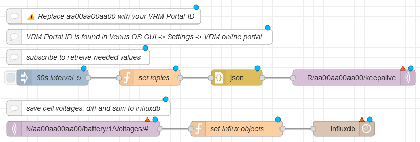
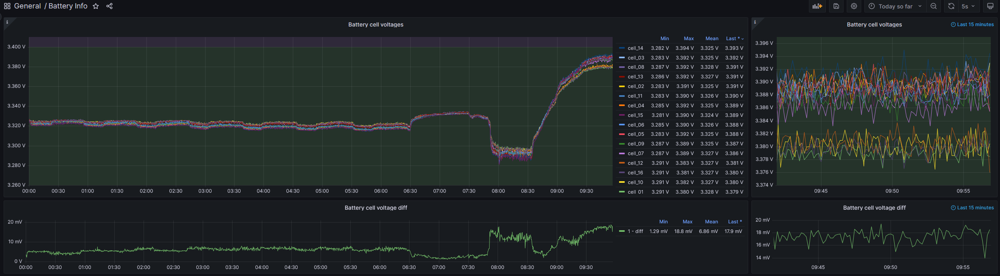

# Track individual battery cell voltages

To track individual cell voltages of your battery in Venus OS you need [Venus OS Large](https://www.victronenergy.com/live/venus-os:large), [InfluxDB](https://portal.influxdata.com/downloads/#influx1x) and [Grafana](https://grafana.com/grafana/download?edition=oss) and [Grafana](https://grafana.com/grafana/download?edition=oss).

The data flow is:

`MQTT on Venus OS/GX device -> Node-RED on the Venus OS/GX device -> InfluxDB on another device -> Grafana on the same device as InfluxDB`

[InfluxDB](https://portal.influxdata.com/downloads/#influx1x) and [Grafana](https://grafana.com/grafana/download?edition=oss) can be used as Docker containers.

I reccomend InfluxDB 1.8 with the [node-red-contrib-influxdb](https://flows.nodered.org/node/node-red-contrib-influxdb)

## Node-RED

Import the Node-RED flow and add/select your MQTT broker (Venus OS) in the MQTT nodes and InfluxDB in the InfluxDB nodes:




<details><summary>JSON Flow</summary>

```json
[
    {
        "id": "d4b1489e17daa213",
        "type": "mqtt in",
        "z": "42e5fe8b46267f4b",
        "name": "",
        "topic": "N/aa00aa00aa00/battery/1/Voltages/#",
        "qos": "2",
        "datatype": "auto-detect",
        "broker": "",
        "nl": false,
        "rap": true,
        "rh": 0,
        "inputs": 0,
        "x": 270,
        "y": 700,
        "wires": [
            [
                "3fc0a46a34bb0380"
            ]
        ]
    },
    {
        "id": "3fc0a46a34bb0380",
        "type": "function",
        "z": "42e5fe8b46267f4b",
        "name": "set Influx objects",
        "func": "var topic       = msg.topic.replace(/N\\/[0-9A-Za-z]{12}\\//g, \"\");\nvar topic_split = topic.split(\"/\");\nvar battery     = topic_split[1];\nvar object      = topic_split[3].toLowerCase();\nvar value       = Math.round(msg.payload.value * 1000) / 1000;\n\nif(object.includes(\"cell\") && object.length == 5){\n    object = object.replace(\"cell\", \"cell_0\");\n} else {\n    object = object.replace(\"cell\", \"cell_\");\n}\n\n\nif(isNaN(value) == false){\n    \n    // do not store entries with a cell voltage of 0\n    if(object.includes(\"cell\") == false || value != 0){\n    \n        msg.topic = topic;\n        msg.payload = [{\n            \"value\": value\n        },\n        {\n            \"host\": \"nodered.docker.local\",\n            \"source\": \"raspberry-pi-mqtt\",\n            \"battery\": battery,\n            \"object\": object\n        }]\n        \n        return msg;\n    \n    }\n    \n} else {\n    \n    return null;\n    \n}",
        "outputs": 1,
        "noerr": 0,
        "initialize": "",
        "finalize": "",
        "libs": [],
        "x": 570,
        "y": 700,
        "wires": [
            [
                "4e0dd67bcc28328d"
            ]
        ]
    },
    {
        "id": "4e0dd67bcc28328d",
        "type": "influxdb out",
        "z": "42e5fe8b46267f4b",
        "influxdb": "",
        "name": "",
        "measurement": "battery_cells",
        "precision": "",
        "retentionPolicy": "",
        "database": "database",
        "precisionV18FluxV20": "ms",
        "retentionPolicyV18Flux": "",
        "org": "organisation",
        "bucket": "bucket",
        "x": 780,
        "y": 700,
        "wires": []
    },
    {
        "id": "1a8d65c7365533b1",
        "type": "mqtt out",
        "z": "42e5fe8b46267f4b",
        "name": "",
        "topic": "R/aa00aa00aa00/keepalive",
        "qos": "0",
        "retain": "false",
        "respTopic": "",
        "contentType": "",
        "userProps": "",
        "correl": "",
        "expiry": "",
        "broker": "",
        "x": 800,
        "y": 600,
        "wires": []
    },
    {
        "id": "f6719f6e18806b8c",
        "type": "inject",
        "z": "42e5fe8b46267f4b",
        "name": "30s interval",
        "props": [
            {
                "p": "payload"
            }
        ],
        "repeat": "30",
        "crontab": "",
        "once": false,
        "onceDelay": 0.1,
        "topic": "",
        "payload": "",
        "payloadType": "str",
        "x": 210,
        "y": 600,
        "wires": [
            [
                "97c53dd8a1d69502"
            ]
        ]
    },
    {
        "id": "97c53dd8a1d69502",
        "type": "function",
        "z": "42e5fe8b46267f4b",
        "name": "set topics",
        "func": "msg.payload = [\n    \"battery/1/Voltages/#\",\n];\n\nreturn msg;",
        "outputs": 1,
        "noerr": 0,
        "initialize": "",
        "finalize": "",
        "libs": [],
        "x": 400,
        "y": 600,
        "wires": [
            [
                "af2cb839f606f5b8"
            ]
        ]
    },
    {
        "id": "af2cb839f606f5b8",
        "type": "json",
        "z": "42e5fe8b46267f4b",
        "name": "",
        "property": "payload",
        "action": "str",
        "pretty": false,
        "x": 570,
        "y": 600,
        "wires": [
            [
                "1a8d65c7365533b1"
            ]
        ]
    },
    {
        "id": "dbd6aa4f38e3c224",
        "type": "comment",
        "z": "42e5fe8b46267f4b",
        "name": "subscribe to retreive needed values",
        "info": "",
        "x": 260,
        "y": 560,
        "wires": []
    },
    {
        "id": "3d36cf9abff035fd",
        "type": "comment",
        "z": "42e5fe8b46267f4b",
        "name": "VRM Portal ID is found in Venus OS GUI -> Settings -> VRM online portal",
        "info": "",
        "x": 380,
        "y": 520,
        "wires": []
    },
    {
        "id": "56cf642eafd00f21",
        "type": "comment",
        "z": "42e5fe8b46267f4b",
        "name": "save cell voltages, diff and sum to influxdb",
        "info": "",
        "x": 280,
        "y": 660,
        "wires": []
    },
    {
        "id": "cb7a6aef77a35130",
        "type": "comment",
        "z": "42e5fe8b46267f4b",
        "name": "⚠️ Replace aa00aa00aa00 with your VRM Portal ID",
        "info": "",
        "x": 310,
        "y": 480,
        "wires": []
    }
]
```
</details>

<br>

## Grafana

Import the dashboard provided via panel JSON and select the database where you stored your battery data with Node-RED:



<details><summary>Panel JSON</summary>

```json
{
  "__inputs": [
    {
      "name": "DS_VICTRON_ENERGY",
      "label": "victron_energy",
      "description": "",
      "type": "datasource",
      "pluginId": "influxdb",
      "pluginName": "InfluxDB"
    }
  ],
  "__elements": {},
  "__requires": [
    {
      "type": "grafana",
      "id": "grafana",
      "name": "Grafana",
      "version": "9.4.3"
    },
    {
      "type": "datasource",
      "id": "influxdb",
      "name": "InfluxDB",
      "version": "1.0.0"
    },
    {
      "type": "panel",
      "id": "timeseries",
      "name": "Time series",
      "version": ""
    }
  ],
  "annotations": {
    "list": [
      {
        "builtIn": 1,
        "datasource": {
          "type": "grafana",
          "uid": "-- Grafana --"
        },
        "enable": true,
        "hide": true,
        "iconColor": "rgba(0, 211, 255, 1)",
        "name": "Annotations & Alerts",
        "target": {
          "limit": 100,
          "matchAny": false,
          "tags": [],
          "type": "dashboard"
        },
        "type": "dashboard"
      }
    ]
  },
  "editable": true,
  "fiscalYearStartMonth": 0,
  "graphTooltip": 0,
  "id": null,
  "links": [],
  "liveNow": false,
  "panels": [
    {
      "datasource": {
        "type": "influxdb",
        "uid": "${DS_VICTRON_ENERGY}"
      },
      "description": "Used voltage range: 2,90 V - 3,45 V<br>\nBalancing starts @3,40 V",
      "fieldConfig": {
        "defaults": {
          "color": {
            "mode": "palette-classic"
          },
          "custom": {
            "axisCenteredZero": false,
            "axisColorMode": "text",
            "axisLabel": "",
            "axisPlacement": "auto",
            "barAlignment": 0,
            "drawStyle": "line",
            "fillOpacity": 0,
            "gradientMode": "none",
            "hideFrom": {
              "legend": false,
              "tooltip": false,
              "viz": false
            },
            "lineInterpolation": "linear",
            "lineWidth": 1,
            "pointSize": 5,
            "scaleDistribution": {
              "type": "linear"
            },
            "showPoints": "never",
            "spanNulls": 300000,
            "stacking": {
              "group": "A",
              "mode": "none"
            },
            "thresholdsStyle": {
              "mode": "area"
            }
          },
          "decimals": 3,
          "mappings": [],
          "thresholds": {
            "mode": "absolute",
            "steps": [
              {
                "color": "red",
                "value": null
              },
              {
                "color": "orange",
                "value": 2.5
              },
              {
                "color": "green",
                "value": 2.9
              },
              {
                "color": "purple",
                "value": 3.4
              },
              {
                "color": "orange",
                "value": 3.45
              },
              {
                "color": "red",
                "value": 3.65
              }
            ]
          },
          "unit": "volt"
        },
        "overrides": []
      },
      "gridPos": {
        "h": 12,
        "w": 18,
        "x": 0,
        "y": 0
      },
      "id": 9,
      "interval": "10s",
      "options": {
        "legend": {
          "calcs": [
            "min",
            "max",
            "mean",
            "lastNotNull"
          ],
          "displayMode": "table",
          "placement": "right",
          "showLegend": true,
          "sortBy": "Last *",
          "sortDesc": true,
          "width": 320
        },
        "tooltip": {
          "mode": "multi",
          "sort": "desc"
        }
      },
      "targets": [
        {
          "alias": "$tag_object",
          "datasource": {
            "type": "influxdb",
            "uid": "${DS_VICTRON_ENERGY}"
          },
          "groupBy": [
            {
              "params": [
                "$__interval"
              ],
              "type": "time"
            },
            {
              "params": [
                "battery"
              ],
              "type": "tag"
            },
            {
              "params": [
                "object"
              ],
              "type": "tag"
            },
            {
              "params": [
                "null"
              ],
              "type": "fill"
            }
          ],
          "measurement": "battery_cells",
          "orderByTime": "ASC",
          "policy": "default",
          "refId": "A",
          "resultFormat": "time_series",
          "select": [
            [
              {
                "params": [
                  "value"
                ],
                "type": "field"
              },
              {
                "params": [],
                "type": "mean"
              }
            ]
          ],
          "tags": [
            {
              "key": "object",
              "operator": "!=",
              "value": "sum"
            },
            {
              "condition": "AND",
              "key": "object",
              "operator": "!=",
              "value": "diff"
            }
          ]
        }
      ],
      "title": "Battery cell voltages",
      "type": "timeseries"
    },
    {
      "datasource": {
        "type": "influxdb",
        "uid": "${DS_VICTRON_ENERGY}"
      },
      "description": "Used voltage range: 2,90 V - 3,45 V<br>\nBalancing starts @3,40 V",
      "fieldConfig": {
        "defaults": {
          "color": {
            "mode": "palette-classic"
          },
          "custom": {
            "axisCenteredZero": false,
            "axisColorMode": "text",
            "axisLabel": "",
            "axisPlacement": "auto",
            "barAlignment": 0,
            "drawStyle": "line",
            "fillOpacity": 0,
            "gradientMode": "none",
            "hideFrom": {
              "legend": false,
              "tooltip": false,
              "viz": false
            },
            "lineInterpolation": "linear",
            "lineWidth": 1,
            "pointSize": 5,
            "scaleDistribution": {
              "type": "linear"
            },
            "showPoints": "never",
            "spanNulls": 300000,
            "stacking": {
              "group": "A",
              "mode": "none"
            },
            "thresholdsStyle": {
              "mode": "area"
            }
          },
          "decimals": 3,
          "mappings": [],
          "thresholds": {
            "mode": "absolute",
            "steps": [
              {
                "color": "red",
                "value": null
              },
              {
                "color": "orange",
                "value": 2.5
              },
              {
                "color": "green",
                "value": 2.9
              },
              {
                "color": "purple",
                "value": 3.4
              },
              {
                "color": "orange",
                "value": 3.45
              },
              {
                "color": "red",
                "value": 3.65
              }
            ]
          },
          "unit": "volt"
        },
        "overrides": []
      },
      "gridPos": {
        "h": 12,
        "w": 6,
        "x": 18,
        "y": 0
      },
      "id": 15,
      "interval": "10s",
      "options": {
        "legend": {
          "calcs": [
            "min",
            "max",
            "mean",
            "lastNotNull"
          ],
          "displayMode": "table",
          "placement": "right",
          "showLegend": false,
          "sortBy": "Last *",
          "sortDesc": true
        },
        "tooltip": {
          "mode": "multi",
          "sort": "desc"
        }
      },
      "targets": [
        {
          "alias": "$tag_object",
          "datasource": {
            "type": "influxdb",
            "uid": "${DS_VICTRON_ENERGY}"
          },
          "groupBy": [
            {
              "params": [
                "$__interval"
              ],
              "type": "time"
            },
            {
              "params": [
                "battery"
              ],
              "type": "tag"
            },
            {
              "params": [
                "object"
              ],
              "type": "tag"
            },
            {
              "params": [
                "previous"
              ],
              "type": "fill"
            }
          ],
          "measurement": "battery_cells",
          "orderByTime": "ASC",
          "policy": "default",
          "query": "SELECT mean(\"value\") FROM \"battery_cells\" WHERE (\"object\" != 'sum' AND \"object\" != 'diff') AND \"time\" >  now() - 15m GROUP BY time($__interval), \"battery\", \"object\" fill(null)",
          "rawQuery": false,
          "refId": "A",
          "resultFormat": "time_series",
          "select": [
            [
              {
                "params": [
                  "value"
                ],
                "type": "field"
              },
              {
                "params": [],
                "type": "mean"
              }
            ]
          ],
          "tags": [
            {
              "key": "object",
              "operator": "!=",
              "value": "sum"
            },
            {
              "condition": "AND",
              "key": "object",
              "operator": "!=",
              "value": "diff"
            }
          ]
        }
      ],
      "timeFrom": "15m",
      "title": "Battery cell voltages",
      "type": "timeseries"
    },
    {
      "datasource": {
        "type": "influxdb",
        "uid": "${DS_VICTRON_ENERGY}"
      },
      "fieldConfig": {
        "defaults": {
          "color": {
            "mode": "palette-classic"
          },
          "custom": {
            "axisCenteredZero": false,
            "axisColorMode": "text",
            "axisLabel": "",
            "axisPlacement": "auto",
            "barAlignment": 0,
            "drawStyle": "line",
            "fillOpacity": 0,
            "gradientMode": "none",
            "hideFrom": {
              "legend": false,
              "tooltip": false,
              "viz": false
            },
            "lineInterpolation": "linear",
            "lineWidth": 1,
            "pointSize": 5,
            "scaleDistribution": {
              "type": "linear"
            },
            "showPoints": "never",
            "spanNulls": 300000,
            "stacking": {
              "group": "A",
              "mode": "none"
            },
            "thresholdsStyle": {
              "mode": "off"
            }
          },
          "mappings": [],
          "thresholds": {
            "mode": "absolute",
            "steps": [
              {
                "color": "green",
                "value": null
              },
              {
                "color": "red",
                "value": 80
              }
            ]
          },
          "unit": "volt"
        },
        "overrides": []
      },
      "gridPos": {
        "h": 5,
        "w": 18,
        "x": 0,
        "y": 12
      },
      "id": 10,
      "interval": "10s",
      "options": {
        "legend": {
          "calcs": [
            "min",
            "max",
            "mean",
            "lastNotNull"
          ],
          "displayMode": "table",
          "placement": "right",
          "showLegend": true,
          "width": 320
        },
        "tooltip": {
          "mode": "multi",
          "sort": "desc"
        }
      },
      "targets": [
        {
          "alias": "$tag_battery - $tag_object",
          "datasource": {
            "type": "influxdb",
            "uid": "${DS_VICTRON_ENERGY}"
          },
          "groupBy": [
            {
              "params": [
                "$__interval"
              ],
              "type": "time"
            },
            {
              "params": [
                "battery"
              ],
              "type": "tag"
            },
            {
              "params": [
                "object"
              ],
              "type": "tag"
            },
            {
              "params": [
                "null"
              ],
              "type": "fill"
            }
          ],
          "measurement": "battery_cells",
          "orderByTime": "ASC",
          "policy": "default",
          "refId": "A",
          "resultFormat": "time_series",
          "select": [
            [
              {
                "params": [
                  "value"
                ],
                "type": "field"
              },
              {
                "params": [],
                "type": "mean"
              }
            ]
          ],
          "tags": [
            {
              "condition": "AND",
              "key": "object",
              "operator": "=",
              "value": "diff"
            }
          ]
        }
      ],
      "title": "Battery cell voltage diff",
      "type": "timeseries"
    },
    {
      "datasource": {
        "type": "influxdb",
        "uid": "${DS_VICTRON_ENERGY}"
      },
      "fieldConfig": {
        "defaults": {
          "color": {
            "mode": "palette-classic"
          },
          "custom": {
            "axisCenteredZero": false,
            "axisColorMode": "text",
            "axisLabel": "",
            "axisPlacement": "auto",
            "barAlignment": 0,
            "drawStyle": "line",
            "fillOpacity": 0,
            "gradientMode": "none",
            "hideFrom": {
              "legend": false,
              "tooltip": false,
              "viz": false
            },
            "lineInterpolation": "linear",
            "lineWidth": 1,
            "pointSize": 5,
            "scaleDistribution": {
              "type": "linear"
            },
            "showPoints": "never",
            "spanNulls": 300000,
            "stacking": {
              "group": "A",
              "mode": "none"
            },
            "thresholdsStyle": {
              "mode": "off"
            }
          },
          "mappings": [],
          "thresholds": {
            "mode": "absolute",
            "steps": [
              {
                "color": "green",
                "value": null
              },
              {
                "color": "red",
                "value": 80
              }
            ]
          },
          "unit": "volt"
        },
        "overrides": []
      },
      "gridPos": {
        "h": 5,
        "w": 6,
        "x": 18,
        "y": 12
      },
      "id": 16,
      "interval": "10s",
      "options": {
        "legend": {
          "calcs": [
            "min",
            "max",
            "mean",
            "lastNotNull"
          ],
          "displayMode": "table",
          "placement": "right",
          "showLegend": false
        },
        "tooltip": {
          "mode": "multi",
          "sort": "desc"
        }
      },
      "targets": [
        {
          "alias": "$tag_battery - $tag_object",
          "datasource": {
            "type": "influxdb",
            "uid": "${DS_VICTRON_ENERGY}"
          },
          "groupBy": [
            {
              "params": [
                "$__interval"
              ],
              "type": "time"
            },
            {
              "params": [
                "battery"
              ],
              "type": "tag"
            },
            {
              "params": [
                "object"
              ],
              "type": "tag"
            },
            {
              "params": [
                "null"
              ],
              "type": "fill"
            }
          ],
          "measurement": "battery_cells",
          "orderByTime": "ASC",
          "policy": "default",
          "refId": "A",
          "resultFormat": "time_series",
          "select": [
            [
              {
                "params": [
                  "value"
                ],
                "type": "field"
              },
              {
                "params": [],
                "type": "mean"
              }
            ]
          ],
          "tags": [
            {
              "condition": "AND",
              "key": "object",
              "operator": "=",
              "value": "diff"
            }
          ]
        }
      ],
      "timeFrom": "15m",
      "title": "Battery cell voltage diff",
      "type": "timeseries"
    }
  ],
  "refresh": "5s",
  "revision": 1,
  "schemaVersion": 38,
  "style": "dark",
  "tags": [],
  "templating": {
    "list": []
  },
  "time": {
    "from": "now/d",
    "to": "now"
  },
  "timepicker": {
    "refresh_intervals": [
      "5s",
      "15s",
      "30s",
      "1m",
      "5m",
      "15m",
      "30m"
    ]
  },
  "timezone": "",
  "title": "Battery Info",
  "uid": "B3pLeBa4k",
  "version": 3,
  "weekStart": ""
}
```
</details>
